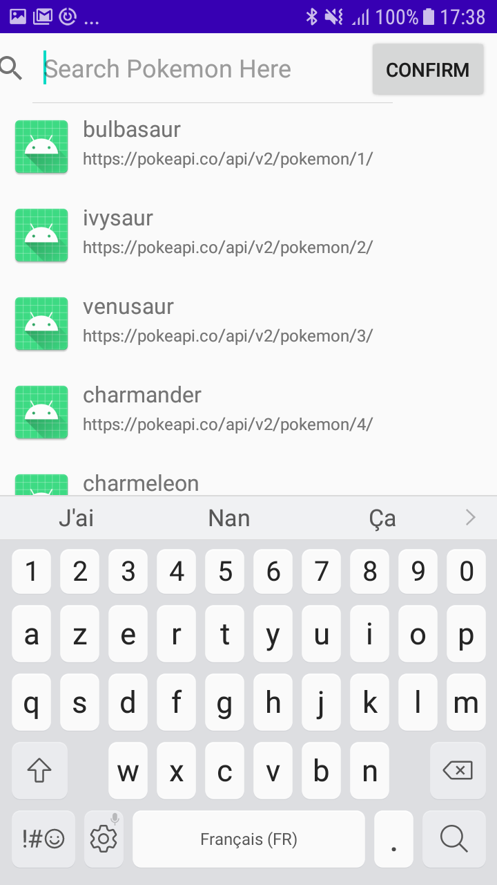
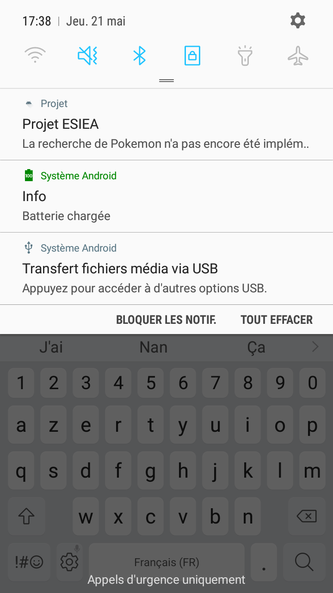

<b>Présentation : </b>

Ce projet a été réalisé par CHARAFI Elias, étudiant en 3ème année à l'ESIEA. Le but de ce projet était de suivre une série de TP afin de créer une application mobile et d'implémenter des fonctionnalités pour apprendre la programmation mobile.

Les fonctionnalités attendues sont :

-Un écran avec une liste d'éléments
-Un écran avec le détail d'un élément
-Un appel WebService à une API Rest
-Le stockage de données en cache
-Toute autre fonctionnalité supplémentaires

La liste des fonctionnalités réalisés dans ce projet sont :

-Un écran avec une liste d'éléments
-Un appel WebService à une API Rest (PokeAPI)
-Le stockage de données en cache
-L'ajout d'une barre de recherche
-L'ajout d'un bouton lié à la barre de recherche
-Une notification qui se déclenche lors d'un appui sur le bouton

<b>Screenshot des fonctionnalités :</b>

<b>Détail supplémentaire :</b>

Initialement, il était prévu que la barre de recherche et le bouton "confirm" servent à chercher des informations sur des Pokemon mais suite à certains soucis que je n'ai pas pu régler, je me suis limité à créer une notification qui affiche le message "La recherche de Pokemon n'a pas encore été implémentée".
